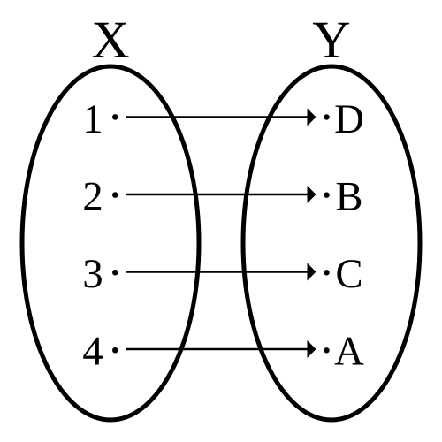

# ADR: Richting van UML-relaties in natuurlijke taal output

## Status

Accepted

## Context

In PlantUML (en UML in het algemeen) kunnen relaties tussen klassen in beide richtingen worden genoteerd, bijvoorbeeld:

- `A --> B`
- `B <-- A`

Dit heeft primair invloed op de visuele lay-out van het diagram (de richting van de pijl), en wordt vaak gebruikt om het diagram intuïtiever te maken qua leesrichting of positionering van klassen.

## Opties

- **Optie 1: Richting expliciet maken in natuurlijke taal**  
  De parser beschrijft de richting van de relatie zoals genoteerd in de diagramcode (bijvoorbeeld "A heeft een afhankelijkheid naar B" vs. "B heeft een afhankelijkheid vanaf A").
- **Optie 2: Richting normaliseren**  
  De parser normaliseert de richting van relaties in de natuurlijke taal output, bijvoorbeeld altijd van subject naar object, ongeacht de notatie in de diagramcode. Dit maakt de beschrijving eenvoudiger, maar niet bijectief: de oorspronkelijke diagramcode is niet altijd eenduidig te reconstrueren.

## Decision

De parser maakt de richting van de relatie in de beschrijving expliciet:

- `A ..> B`  →  "A heeft een afhankelijkheid naar B"
- `B <.. A`  →  "B heeft een afhankelijkheid vanaf A"

Hierdoor blijft de parser een **bijectieve functie**: de natuurlijke taal output bevat voldoende informatie om de oorspronkelijke diagramcode (inclusief pijlrichting) te reconstrueren, en dus ook het diagram in een specifieke lay-out.

## Consequenties

- De natuurlijke taal output is nu uniek voor elke diagramcode, inclusief pijlrichting.
- Het is mogelijk om op basis van de tekstuele beschrijving het originele PlantUML-diagram (en dus de lay-out) te reconstrueren.
- Voor screenreader-gebruikers wordt de richting van relaties expliciet uitgesproken, wat de toegankelijkheid en traceerbaarheid vergroot.
- Bestaande tests en beschrijvingen moeten worden uitgebreid met scenario's voor omgekeerde pijlrichtingen.

## Openstaande acties

- Testgevallen toevoegen voor relaties met omgekeerde pijlrichting.
- Parser uitbreiden zodat deze richting expliciet verwerkt in de beschrijving.

## Bronnen

- [Bijectie (Wikipedia)](https://nl.wikipedia.org/wiki/Bijectie)
- 
- [WCAG 2.1](https://www.w3.org/WAI/standards-guidelines/wcag/)

---

*Datum: 2026-01-31*
*Auteur: Bart van der Wal & GitHub Copilot*
