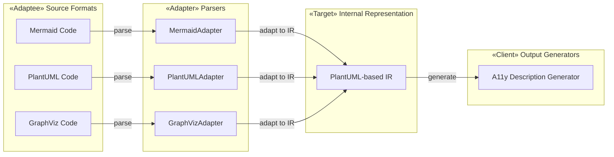

# ADR: PlantUML als interne standaard representatie

## Status

Proposed

## Context

Het remark-kroki-a11y plugin moet meerdere diagram-as-text formaten ondersteunen: PlantUML, Mermaid, en potentieel anderen (GraphViz, D2, etc.). Elk formaat heeft een eigen syntax, maar voor dezelfde diagramtypes (bijv. klassediagrammen) is de semantische inhoud equivalent.

**Het N+1 probleem:** XKCD 927 illustreert perfect wat er gebeurt als je probeert "één standaard te maken die alle anderen vervangt":

*Situatie: 14 concurrerende standaarden. "We maken één universele standaard!" Resultaat: 15 concurrerende standaarden.*

We willen GEEN nieuwe standaard creëren. In plaats daarvan gebruiken we het **Adapter Pattern** (GoF) om bestaande formaten te verbinden met een gemeenschappelijke interne representatie.

## Beslissing

We gebruiken **PlantUML's datastructuur als interne representatie (IR)**, met Adapters voor elk invoerformaat.

### Waarom PlantUML als basis?

1. **Meest complete UML ondersteuning** - Ondersteunt alle 14 UML diagramtypes
2. **Goed gedocumenteerd** - Uitgebreide documentatie en grote community
3. **Stabiele syntax** - Weinig breaking changes over de jaren
4. **Geen nieuwe standaard** - We hergebruiken een bestaande, bewezen structuur

### Adapter Pattern architectuur

Zie ook het C4 Component diagram in de Docusaurus documentatie voor een meer gedetailleerde weergave.

Elke **Adapter**:
- Parseert de broncode van één specifiek formaat
- Converteert naar de PlantUML-gebaseerde IR
- Behoudt semantische informatie (klassen, relaties, visibility, etc.)

De **Description Generator**:
- Werkt alleen met de IR
- Genereert consistente toegankelijke beschrijvingen
- Hoeft niet te weten welk bronformaat gebruikt is

## Gevolgen

### Positief

- **Geen N+1 probleem** - We maken geen nieuwe standaard, alleen adapters
- **Consistente output** - Zelfde diagram, zelfde beschrijving, ongeacht bronformaat
- **Uitbreidbaar** - Nieuw formaat = nieuwe Adapter, geen wijzigingen aan generator
- **Testbaar** - Test elke adapter apart, test generator met IR

### Negatief

- **Conversieverlies mogelijk** - Niet alle formaten hebben exacte 1:1 mapping
- **PlantUML-bias** - Formaat-specifieke features kunnen niet altijd gemapped worden

## Referenties

- [XKCD 927: Standards](https://xkcd.com/927/)
- [GoF Adapter Pattern](https://refactoring.guru/design-patterns/adapter)
- [PlantUML Language Reference](https://plantuml.com/guide)

---

*Datum: 2026-01-31*
*Auteur: Bart van der Wal & Claude Code*
