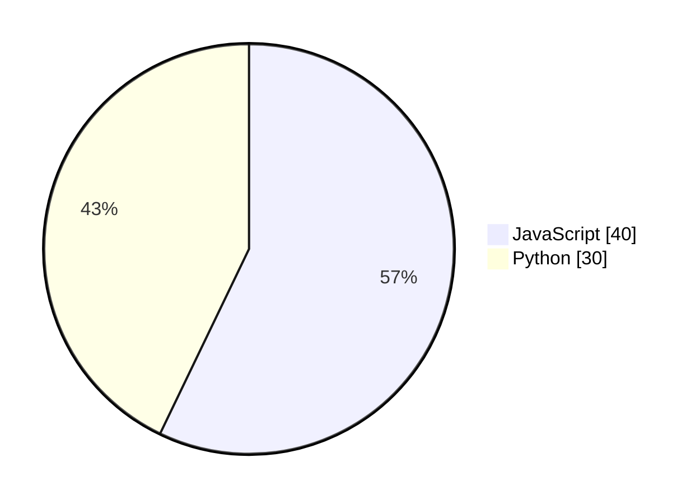

# ADR-0011: Faithful representation of diagram source

## Status

Accepted

## Context

When generating natural language descriptions for diagrams, we need to decide how literally we should represent the source code versus adding computed or inferred information.

The key principle: **"Faithful" means matching what sighted users see, not just the raw source code.**

### Example 1: Pie Chart Percentages

Mermaid pie charts with `showData` display both raw values AND percentages visually:



Since Mermaid **displays** "JavaScript: 40 (57%)" in the rendered diagram, our description should match: "JavaScript: 40 (57%)". This is faithful to what sighted users see.

### Example 2: Activity Diagram Step Numbers

PlantUML activity diagrams do NOT automatically number steps in the visual:

```plantuml
:Read input;
:Process data;
:Write output;
```

Our description should NOT add "Step 1: Read input, Step 2: Process data..." because sighted users don't see those numbers.

### Example 3: Sequence Diagram Auto-numbering

PlantUML only shows message numbers when `autonumber` is specified:

```plantuml
autonumber
Alice -> Bob: Request
Bob -> Alice: Response
```

Only with `autonumber` should our description include "1: Request, 2: Response".

Similarly, for class diagrams, should we infer relationships that aren't explicitly stated, or add information about design patterns we detect?

## Options

### Option A: Faithful representation (chosen)

Generate descriptions that closely mirror what is written in the diagram source code. Do not compute, infer, or add information beyond what the author explicitly specified.

**Pros:**

- Predictable output - users know what to expect
- No risk of incorrect calculations or inferences
- Respects the author's intent
- Simpler implementation
- Easier to test and verify

**Cons:**

- May miss opportunities to provide "helpful" additional context
- Raw values may be less immediately meaningful than percentages

### Option B: Enhanced/computed descriptions

Compute additional information (percentages, totals, inferred relationships) to provide richer descriptions.

**Pros:**

- Potentially more informative for end users
- Could provide insights the visual representation shows implicitly

**Cons:**

- Risk of incorrect calculations
- May not match author's intent
- More complex implementation
- Harder to test edge cases
- May conflict with what the visual actually shows

## Decision

We choose **Option A: Faithful representation** - faithful to **what is visually rendered**, not just the source code.

The a11y description should accurately reflect what sighted users see in the rendered diagram. We do not:

1. **Add information not in the visual** - Don't add step numbers to activity diagrams that don't show them
2. **Infer relationships** - We only describe explicitly stated relationships
3. **Add design pattern names** - We describe the structure, not our interpretation of it
4. **Correct or normalize** - If the source has inconsistencies, we reflect them

### When to compute values

We DO compute values when the diagram tool itself computes and displays them:

- ✅ **Pie chart percentages**: Mermaid `pie showData` displays percentages, so we include them
- ✅ **Sequence message numbers**: Only when `autonumber` directive is present
- ❌ **Activity step numbers**: PlantUML doesn't show these, so we don't add them

### Exceptions

The following transformations are acceptable as they improve readability without changing meaning:

- Converting visibility symbols (+, -, #) to words (public, private, protected)
- Translating diagram keywords to natural language
- Structuring output with proper grammar and punctuation

## Consequences

### Positive

- Descriptions are predictable and verifiable
- No risk of computational errors
- Implementation remains simple
- Testing is straightforward
- Users can trust the description matches the source

### Negative

- Requires understanding what each diagram tool renders visually
- Descriptions may be less "polished" than hand-written alternatives
- Edge cases like `pie` without `showData` require careful consideration (see [issue #5632](https://github.com/mermaid-js/mermaid/issues/5632))

### Mitigation

For cases where computed values would be helpful, users can use the `customDescription` attribute to provide their own enhanced description.

## References

- ADR-0009: No automatic step numbering in activity diagrams (related principle)
- W3C WCAG: Alternative text should convey the same information as the visual
