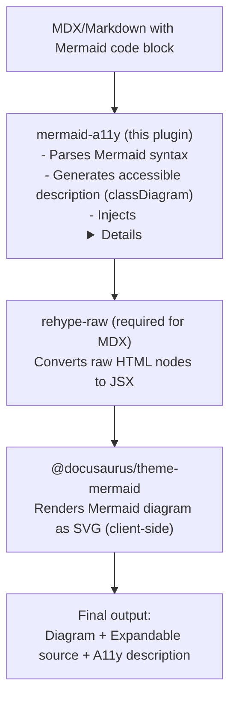
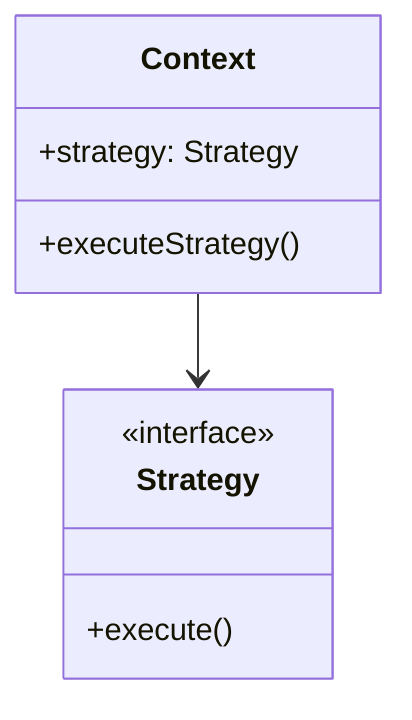
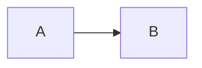
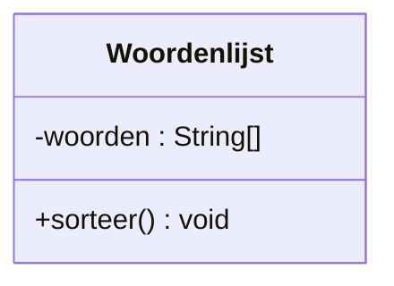

# mermaid-a11y

A [Remark plugin](https://docusaurus.io/docs/markdown-features/plugins#creating-new-rehyperemark-plugins) that adds expandable source code blocks and accessible descriptions below native Mermaid diagrams in Docusaurus.

## Features

- Works with **native Docusaurus Mermaid** (`@docusaurus/theme-mermaid`)
- **No external server dependency** - diagrams render client-side in the browser
- Adds collapsible `<details>` block with Mermaid source code
- **Accessibility (A11y)**: Generates human-readable descriptions for screen readers (classDiagram support)
- **Keyboard accessible**: Native `<details>` element works with Enter/Space
- **Localization**: Supports Dutch (nl) and English (en)
- Auto-detects diagram type (classDiagram, sequenceDiagram, flowchart, etc.)

## Architecture

### Plugin Overview

This plugin extends Docusaurus's native Mermaid rendering with accessibility features:



### Architecture Decision Records (ADRs)

Key design decisions are documented in the [adr/](adr/) folder:

| ADR                                                    | Decision                            | Summary                                                            |
| ------------------------------------------------------ | ----------------------------------- | ------------------------------------------------------------------ |
| [ADR-0001](adr/0001-use-remark-plugin-not-rehype.md)   | Use Remark Plugin (not Rehype)      | Process Markdown AST for syntax detection, separate from rendering |
| [ADR-0002](adr/0002-use-native-mermaid-not-kroki.md)   | Use Native Mermaid instead of Kroki | Client-side rendering, no external dependencies, works offline     |
| [ADR-0003](adr/0003-require-rehype-raw-for-mdx.md)     | Require rehype-raw for MDX          | Enable raw HTML nodes in MDX files                                 |

## Installation

Copy the `plugins/mermaid-a11y` folder to your Docusaurus project.

## Usage

In `docusaurus.config.js`:

```javascript
const rehypeRaw = require('rehype-raw');

// In your preset docs config:
docs: {
  sidebarPath: require.resolve('./sidebars.js'),
  remarkPlugins: [
    [require('./plugins/mermaid-a11y'), {
      // All options are optional:
      defaultExpanded: false,
      summaryText: 'Mermaid broncode voor "{title}"',
      a11ySummaryText: 'Toegankelijke beschrijving voor "{title}"',
      cssClass: 'mermaid-expandable-source',
      locale: 'nl',                    // 'nl' or 'en'
      generateA11yDescription: true,   // Generate accessible descriptions
    }],
  ],
  rehypePlugins: [
    rehypeRaw,  // Required for raw HTML in MDX files
  ],
},

// Make sure you have Mermaid enabled:
markdown: {
  mermaid: true,
},
themes: ['@docusaurus/theme-mermaid'],
```

Add the styles to your `custom.css`:

```css
/* Expandable source code block for Mermaid diagrams (A11y) */
.mermaid-expandable-source summary,
.mermaid-a11y-description-details summary {
  cursor: pointer;
  font-weight: 500;
  padding: 0.5rem 0;
  user-select: none;
}

.mermaid-expandable-source summary:hover,
.mermaid-a11y-description-details summary:hover {
  color: var(--ifm-color-primary);
}

.mermaid-expandable-source pre,
.mermaid-a11y-description-content pre {
  background: var(--prism-background-color, #1e1e1e);
  color: var(--prism-color, #d4d4d4);
  padding: 1rem;
  border-radius: var(--ifm-code-border-radius, 4px);
  overflow-x: auto;
  margin: 0.5rem 0;
  white-space: pre-wrap;
  word-wrap: break-word;
}

[data-theme='light'] .mermaid-expandable-source pre,
[data-theme='light'] .mermaid-a11y-description-content pre {
  background: var(--ifm-code-background, #f6f8fa);
  color: var(--ifm-font-color-base, #1c1e21);
}

/* Visually hidden but accessible to screen readers */
.mermaid-a11y-description .visually-hidden {
  position: absolute;
  width: 1px;
  height: 1px;
  padding: 0;
  margin: -1px;
  overflow: hidden;
  clip: rect(0, 0, 0, 0);
  white-space: nowrap;
  border: 0;
}

/* A11y description details styling */
.mermaid-a11y-description-details {
  margin-top: 0.5rem;
  border-left: 3px solid var(--ifm-color-primary);
  padding-left: 0.5rem;
}

.mermaid-a11y-description-details summary::before {
  content: "♿ ";
}

.mermaid-a11y-description-content {
  font-size: 0.9em;
}

.mermaid-a11y-description-content pre {
  line-height: 1.6;
}
```

## Markdown Usage

Source code is shown by default:

~~~markdown

~~~

To hide source for a specific diagram:

~~~markdown

~~~

## Options

| Option | Type | Default | Description |
|--------|------|---------|-------------|
| `defaultExpanded` | boolean | `false` | Show source expanded by default |
| `summaryText` | string | `'Mermaid broncode voor "{title}"'` | Summary text for source code. Supports `{title}` placeholder |
| `a11ySummaryText` | string | `'Toegankelijke beschrijving voor "{title}"'` | Summary text for a11y description |
| `cssClass` | string | `'mermaid-expandable-source'` | CSS class for the source details element |
| `a11yCssClass` | string | `'mermaid-a11y-description'` | CSS class for the a11y description element |
| `locale` | string | `'nl'` | Locale for generated descriptions ('nl' or 'en') |
| `generateA11yDescription` | boolean | `true` | Generate accessible descriptions for supported diagram types |

## Accessibility (A11y) Features

### Screen Reader Description

For `classDiagram` diagrams, the plugin generates a human-readable description that screen readers can announce. This makes UML diagrams accessible to visually impaired users.

**Example input:**



**Generated description (Dutch):**

```text
Klassendiagram met 1 klasse(n) en 0 relatie(s).

Klassen:
1. Klasse Woordenlijst met: privaat attribuut woorden van type String[];
   publieke methode sorteer, zonder parameters, return type void
```

### ARIA Structure

The plugin generates semantic HTML with ARIA roles for screen reader navigation:

```html
<div role="img" aria-label="Klassendiagram met 1 klasse(n)..." class="mermaid-a11y-description">
  <div class="visually-hidden" role="document" aria-label="Klassendiagram">
    <section role="region" aria-label="Klassen">
      <h4>Klassen</h4>
      <ul>
        <li><strong>Klasse Woordenlijst</strong>
          <ul>
            <li>privaat attribuut woorden: String[]</li>
            <li>publieke methode sorteer(): void</li>
          </ul>
        </li>
      </ul>
    </section>
  </div>
</div>
```

### Supported Diagram Types

| Diagram Type    | A11y Description | Source Code |
| --------------- | ---------------- | ----------- |
| classDiagram    | ✅ Yes           | ✅ Yes      |
| sequenceDiagram | ❌ Not yet       | ✅ Yes      |
| flowchart       | ❌ Not yet       | ✅ Yes      |
| erDiagram       | ❌ Not yet       | ✅ Yes      |
| Other types     | ❌ Not yet       | ✅ Yes      |

## Comparison: Native Mermaid vs Kroki

| Feature           | Native Mermaid (this plugin) | Kroki                                 |
| ----------------- | ---------------------------- | ------------------------------------- |
| Server dependency | None (client-side)           | Requires kroki.io or self-hosted      |
| Rendering         | Browser JavaScript           | Server-side                           |
| Offline support   | ✅ Yes                       | ❌ No (needs server)                  |
| Diagram types     | Mermaid only                 | 20+ formats (PlantUML, Mermaid, etc.) |
| Output format     | SVG (dynamic)                | SVG/PNG (static)                      |
| A11y descriptions | ✅ This plugin               | ❌ Not available                      |

**When to use Native Mermaid:**

- You only need Mermaid diagrams
- You want offline/serverless rendering
- You want accessibility features

**When to use Kroki:**

- You need PlantUML, GraphViz, or other diagram formats
- You prefer server-side rendering
- You're OK with external dependency

## File Structure

```text
plugins/mermaid-a11y/
├── index.js                   # Main plugin
├── parsers/
│   └── classDiagramParser.js  # Mermaid classDiagram parser + a11y generator
├── adr/                       # Architecture Decision Records
│   ├── 0001-use-remark-plugin-not-rehype.md
│   ├── 0002-use-native-mermaid-not-kroki.md
│   └── 0003-require-rehype-raw-for-mdx.md
├── package.json
└── README.md                  # This file
```

## License

MIT
