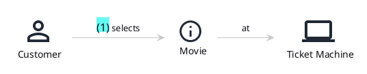

# Domain Stories (PlantUML)

This page demonstrates a Domain Story rendered via PlantUML using the
DomainStory-PlantUML macro library:

- Project: [johthor/DomainStory-PlantUML](https://github.com/johthor/DomainStory-PlantUML)

Domain Storytelling can be a useful bridge between conceptual domain models and
more technical UML design models.

## DomainStory-PlantUML syntax (reference)

The official macro-based notation can be used in two ways:

- portable (works with public `kroki.io`): `!include <DomainStory/domainStory>`
- local include (works with local Docker Kroki include path): `!include domainStory.puml`



## Example: Story flow (rendered in this test site)

This uses the actual DomainStory-PlantUML macros (not a plain sequence diagram),
so the result visually matches the Domain Story style with icons and activity
notation.

```kroki imgType="plantuml" imgTitle="Domain Story: Party" lang="en" a11yDescriptionOverride="Domain Story with Alice and Bob. Activity 1 shows Alice talking about the weather with Bob."
@startuml
!include <DomainStory/domainStory>

!$Story_Layout = "left-to-right"
Person(Alice, "Alice")
Person(Bob, "Bob")
activity(1, Alice, talks about the, Info: weather, with, Bob)
@enduml
```

> Note: this local include requires Kroki with include path support (e.g. the
> provided Docker setup with `docker-compose.kroki.yml`).

## Why this matters

- Domain Stories are often easier to validate with non-technical stakeholders.
- Work objects (ticket, payment, request, etc.) become explicit in the model.
- The flow can be validated early, before committing to technical class/method
  design details.

## Example: Reis boeken (as-is)

Onderstaande EGN-export is opgenomen als visuele referentie:


En hieronder een PlantUML-achtige variant in deze testsite, zodat je dezelfde
flow in text-as-code kunt onderhouden en reviewen:

```kroki imgType="plantuml" imgTitle="Domain Story: Reis boeken (as-is)" lang="nl"
@startuml
!include <DomainStory/domainStory>
!$Story_Layout = "top-to-bottom"
scale 1.35

Person(Reiziger, "Reiziger", "", "", "", "1.4")
System(Site, "Triptop Site", "", "", "", "1.4")
Person(Medewerker, "Medewerker", "", "", "", "1.4")
System(Intern, "Intern Systeem", "", "", "", "1.4")

activity(1, Reiziger, bekijkt, Info: reisvoorbeeelden, op, Site)
activity(2, Reiziger, vult, Document: reisaanvraag, in, Site)
activity(3, Site, stuurt, Document: reisaanvraag, naar, Medewerker)
activity(4, Medewerker, stuurt, Info: reisvoorstel, naar, Reiziger)
activity(5, Reiziger, stuurt, Info: wijzigingen, naar, Medewerker)
activity(6, Reiziger, geeft, Info: reisbevestiging, aan, Medewerker)
activity(7, Medewerker, Maakt, Info: Boeking, _, Intern)
activity(8, Medewerker, genereert, Info: reis, voor, Reiziger)
@enduml
```
