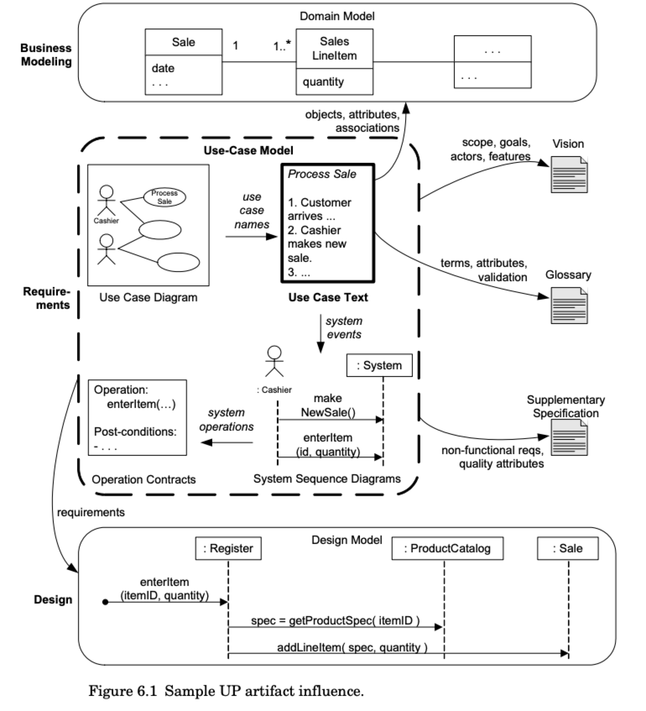

# Domeinmodellen: Larman vs Fowler

Deze pagina toont meerdere PlantUML-diagrammen als test voor de
`remark-kroki-a11y` plugin, en legt tegelijk het verschil uit tussen twee
benaderingen van domeinmodellering. Het verschil zie je vooral terug in:

1. de naamgeving van associaties in klassendiagrammen
2. het detailniveau tussen analyse en ontwerp
3. de mate waarin modelnamen direct aansluiten op programmeertaalconventies

PlantUML ondersteunt beide stijlen; de gegenereerde A11y-beschrijvingen moeten
dat dus ook ondersteunen zodat extra context goed voorgelezen kan worden.

## Twee fasen van modellering

Bij het modelleren van een systeem onderscheiden we twee belangrijke fasen:

1. **Analysefase** - focus op het begrijpen van het probleem in de
   *problem space*
2. **Ontwerpfase** - focus op (hoog-over) technische implementatie in de
   *solution space*

## Larman: Domeinmodel in de Analysefase

Craig Larman beschrijft in zijn boek *Applying UML and Patterns* het
**conceptuele domeinmodel**.

> "A domain model is the most important-and classic-model in OO analysis. It illustrates noteworthy concepts in a domain..." Craig Larman

Dit model:

- Gebruikt **natuurlijke taal** voor associatienamen
- Is bedoeld voor communicatie met domeinexperts en stakeholders
- Focust op **begrip van het domein**, niet op code
- Vermijdt technisch jargon

### Voorbeeld: Webshop domeinmodel (Larman-stijl)

```kroki imgType="plantuml" imgTitle="Larman domeinmodel webshop" lang="nl"
@startuml
class Bestelling {
  besteldatum
  totaalbedrag
}

class Klant {
  naam
  email
}

class Product {
  naam
  prijs
}

class Adres {
  straat
  huisnummer
  postcode
  plaats
}

Bestelling --> Klant : geplaatst door
Bestelling --> "1..*" Product : bevat
Klant --> "0..*" Adres : heeft als afleveradres
Klant --> "1" Adres : heeft als factuuradres
@enduml
```

Let op de associatienamen:
- "geplaatst door" - natuurlijke taal met spaties
- "bevat" - werkwoord dat de relatie beschrijft
- "heeft als afleveradres" - volledige zin die de context geeft

Merk ook op dat er in deze fase nog GEEN methoden staan. Die volgen later in
ontwerp/implementatie en worden vaak afgeleid uit use-cases (die je in een
apart use-case diagram en in tekstuele use-case beschrijvingen uitwerkt).

Zoals Larman in hoofdstuk 6 uitlegt, groeien use-cases van korte schetsen naar
meer gedetailleerde, fully dressed specificaties.



*Figuur 1. Niveaus van use-case detail uit Larman, hoofdstuk 6
("Evolutionary Requirements"), met een verloop van korte use-cases naar fully
dressed use-cases.*  
Bron: [Applying UML and Patterns - Chapter 6 sample PDF](https://www.craiglarman.com/wiki/downloads/applying_uml/larman-ch6-applying-evolutionary-use-cases.pdf).

Zie ook het concrete use-case perspectief in de Roodkapje-voorbeelden:
- [Appendix C (EN)](/examples/little-red-riding-hood-as-uml-diagrams#appendix-c-use-case-diagram-linking-class-and-sequence-views)
- [Bijlage C (NL)](/examples/roodkapje-in-uml-diagrammen#bijlage-c-use-case-diagram-koppeling-tussen-klasse-en-sequentieperspectief)

## Tussen Larman en ontwerp: Domain Storytelling

Een nuttige tussenstap tussen een conceptueel Larman-model en een technisch
ontwerpmodel is **Domain Storytelling**.

Waarom dit helpt:

- Het visualiseert interacties tussen actoren als verhaalstroom, wat vaak
  makkelijker te begrijpen is voor niet-technische stakeholders.
- Het maakt **work objects** expliciet (documenten, items, aanvragen, etc.),
  die in een klassiek domeinmodel soms impliciet blijven.
- De visualisatie is meestal beter geschikt om te presenteren aan product owner
  en klant dan een klassiek UML-klassendiagram.
- Het ondersteunt vroege validatie van aannames: het doel is juist dat
  stakeholders onjuiste of ontbrekende aannames herkennen vóór implementatie.

## Fowler: Domeinmodel in de Ontwerpfase

Martin Fowler beschrijft in "Patterns of Enterprise Application Architecture" het **implementatie-domeinmodel**. Dit model:

> "An object model of the domain that incorporates both behavior and data." [Martin Fowler (2003)](https://martinfowler.com/eaaCatalog/domainModel.html)

- Gebruikt **camelCase** naamgeving die direct naar code vertaalt
- Is bedoeld voor ontwikkelaars
- Focust op **technische correctheid**
- Attributen en associatienamen zijn direct bruikbaar als variabelenamen

### Voorbeeld: Webshop domeinmodel (Fowler-stijl)

```kroki imgType="plantuml" imgTitle="Fowler domeinmodel webshop" lang="nl"
@startuml
class Bestelling {
  -id: Long
  -besteldatum: LocalDate
  -totaalbedrag: BigDecimal
  +berekenTotaal(): BigDecimal
  +voegProductToe(product: Product): void
}

class Klant {
  -id: Long
  -naam: String
  -email: String
  +plaatsBestelling(bestelling: Bestelling): void
}

class Product {
  -id: Long
  -naam: String
  -prijs: BigDecimal
}

class Adres {
  -id: Long
  -straat: String
  -huisnummer: String
  -postcode: String
  -plaats: String
}

Bestelling --> Klant : geplaatstDoor
Bestelling --> "1..*" Product : producten
Klant --> "0..*" Adres : afleveradressen
Klant --> "1" Adres : factuuradres
@enduml
```

Let op de verschillen:
- "geplaatstDoor" - camelCase, direct bruikbaar als attribuutnaam
- "producten" - meervoud voor collecties
- Datatypes zijn toegevoegd (String, LocalDate, BigDecimal)
- Access modifiers zijn expliciet (`-` private, `+` public)

In dit ontwerpmodel zijn nu ook methoden opgenomen, zoals
`berekenTotaal()` en `voegProductToe(...)`. Die ontbreken bewust in het
analysemodel: daar ligt de focus op domeinbegrip en concepten, niet op
technisch gedrag.

## Vergelijking

| Aspect | Larman (Analyse) | Fowler (Ontwerp) |
|--------|------------------|------------------|
| Doel | Domeinbegrip | Implementatie |
| Publiek | Stakeholders, domeinexperts | Ontwikkelaars |
| Naamgeving | Natuurlijke taal | camelCase |
| Voorbeeld | "geplaatst door" | "geplaatstDoor" |
| Datatypes | Optioneel/conceptueel | Technisch specifiek |

## Wanneer welk model?

### Gebruik Larman-stijl als je:
- Met niet-technische stakeholders communiceert
- Het probleemdomein nog aan het verkennen bent
- Documentatie maakt voor domeinexperts
- Event Storming of Domain Discovery doet

### Gebruik Fowler-stijl als je:
- Het technisch ontwerp uitwerkt
- Code gaat genereren of schrijven
- Met het ontwikkelteam communiceert
- API's of database schemas ontwerpt

## Beide stijlen gecombineerd

In de praktijk kun je beide benaderingen combineren door eerst een Larman-stijl domeinmodel te maken voor begrip, en dit vervolgens te verfijnen naar een Fowler-stijl model voor implementatie.

```kroki imgType="plantuml" imgTitle="Evolutie van domeinmodel" lang="nl"
@startuml
class "Analyse: Bestelling" as Bestelling1 {
  besteldatum
  totaalbedrag
}

class "Analyse: Klant" as Klant1 {
  naam
}

class "Ontwerp: Bestelling" as Bestelling2 {
  -besteldatum: LocalDate
  -totaalbedrag: BigDecimal
}

class "Ontwerp: Klant" as Klant2 {
  -naam: String
}

Bestelling1 --> Klant1 : geplaatst door
Bestelling2 --> Klant2 : geplaatstDoor

Bestelling1 ..> Bestelling2 : verfijnt naar
Klant1 ..> Klant2 : verfijnt naar
@enduml
```

## Conclusie

Beide modelleringsstijlen hebben hun plaats in het softwareontwikkelingsproces:

- **Larman** helpt bij het begrijpen en communiceren over het domein
- **Fowler** helpt bij het bouwen van een solide technische implementatie

De keuze hangt af van je publiek en het doel van het model. Vergeet niet dat modellen communicatiemiddelen zijn - kies de stijl die het beste communiceert met je doelgroep.
