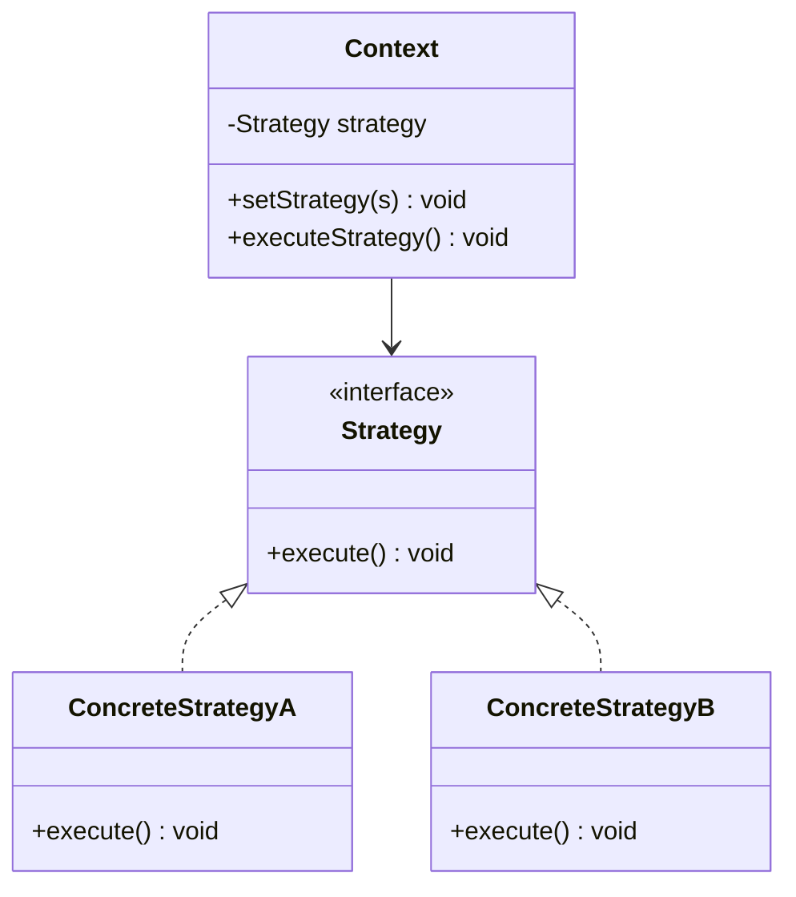

# Mermaid Rendering Comparison

This page compares two ways to render Mermaid diagrams in Docusaurus:

1. **Kroki (server-side)**: Using `remark-kroki-plugin` with `imgType="mermaid"` + `remark-kroki-a11y`
2. **Theme Mermaid (client-side)**: Using `@docusaurus/theme-mermaid` + `remark-mermaid-a11y`

## Key Differences

| Aspect | Kroki (Server-side) | Theme Mermaid (Client-side) |
|--------|---------------------|----------------------------|
| Rendering | Build time via Kroki API | In browser via mermaid.js |
| Output | Static SVG/PNG image | Interactive SVG |
| A11y plugin | `remark-kroki-a11y` | `remark-mermaid-a11y` |
| Code block | ` ```kroki imgType="mermaid" ` | ` ```mermaid ` |
| Offline | Works (image cached) | Requires mermaid.js |
| Styling | Via Kroki themes | Via Mermaid theme config |

---

## Strategy Pattern Comparison

### Via Kroki (with A11y description)

```kroki imgType="mermaid" imgTitle="Strategy Pattern (Kroki)"
classDiagram
    class Context {
        -Strategy strategy
        +setStrategy(s) void
        +executeStrategy() void
    }
    class Strategy {
        <<interface>>
        +execute() void
    }
    class ConcreteStrategyA {
        +execute() void
    }
    class ConcreteStrategyB {
        +execute() void
    }
    Context --> Strategy
    Strategy <|.. ConcreteStrategyA
    Strategy <|.. ConcreteStrategyB
```

### Via Theme Mermaid (with A11y description)



---

## Observations

### Kroki Version

- Generates a static image at build time
- **Has expandable source code and natural language description** (via remark-kroki-a11y)
- Works offline after build
- Consistent rendering across browsers

### Theme Mermaid Version

- Renders dynamically in the browser
- **Now also has accessibility descriptions!** (via remark-mermaid-a11y)
- Interactive (can copy text, zoom, etc.)
- PlantUML-like styling via Mermaid init config

---

## Plugin Architecture

Both plugins follow the same pattern:

```text
Markdown → remark-*-a11y (parses, adds a11y) → renderer (Kroki/theme-mermaid)
```

The `remark-mermaid-a11y` plugin:

1. Intercepts ` ```mermaid ` code blocks before `@docusaurus/theme-mermaid`
2. Parses the Mermaid syntax (currently classDiagram)
3. Generates natural language descriptions
4. Injects expandable `<details>` elements with source code and descriptions
5. Passes the code block through to theme-mermaid for rendering

:::info Configuration
Both plugins are configured in `docusaurus.config.js` under `remarkPlugins`. The mermaid-a11y plugin must come **before** theme-mermaid processes the blocks.
:::
