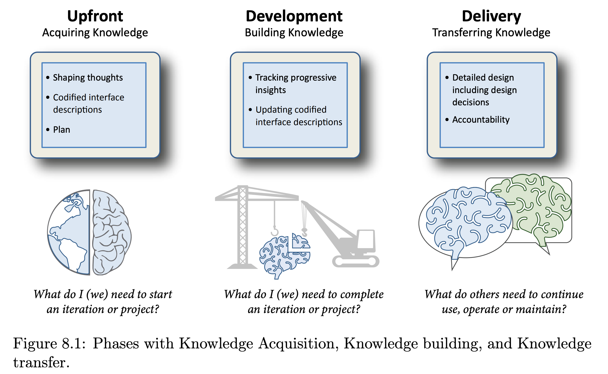
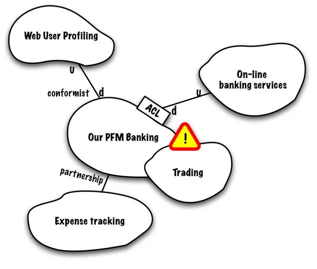

# Roodkapje in UML diagrammen

## Een zachte landing en introductie in UML diagrammen*


*Figuur 1: Roodkapje in het bos (afbeelding gegenereerd met ChatGPT/DALL-E, OpenAI, 2025).*

---

Dit voorbeeld toont hoe je een verhaal in natuurlijke taal (het sprookje van Roodkapje) kunt vertalen naar formele diagrammen; namelijk UML diagrammen. In die zin is het een prima introductie van (enkele) UML diagrammen voor niet technici om een beeld te krijgen, of beginnende technici.

We splitsen het verhaal op in drie delen om een "God Diagram" te voorkomen. Een God diagram is een anti-pattern (net als een ['God object'](https://en.wikipedia.org/wiki/God_object) dat is). Het opsplitsen is een best practice om 'cognitive load' te voorkomen. Om wel ook het overzicht te geven maak je weer een apart diagram, die de onderlinge verbanden aangeeft. Dit is vergelijkbaar met hoe in C4 er ook verschillende zoomniveaus zijn.

In dit artikel gebruiken we voor de drie fasen van het verhaal een toenemend detailniveau: fase A gebruikt berichten als natuurlijke taal, fase B schakelt over naar methode-aanroepen, en fase C voegt daar loops en een Factory pattern aan toe. Dit is een didactische keuze om verschillende notaties te demonstreren in één artikel. In de praktijk van softwareontwikkeling werk je anders: je houdt alle delen op hetzelfde detailniveau, en voegt aan *alle* delen tegelijk meer detail toe naarmate je vordert in de Software Development Life Cycle. Tijdens de analyse modelleer je alle fasen met berichten, tijdens het ontwerp alle fasen met methoden, enzovoort.

---

## Er was eens...

Voordat we het verhaal in sequentiediagrammen vertellen, definiëren we eerst de "wereld" van het sprookje in een domeinmodel. Dit is vergelijkbaar met hoe je in software eerst je domeinmodel opstelt voordat je de use cases uitwerkt.

We gebruiken hier een domeinmodel in de stijl van Larman: focus op de entiteiten (concepten) en hun attributen, zonder methodes en zonder expliciete types. Bij twijfel of iets een primitief attribuut is of een eigen entiteit verdient, kies je voor een aparte entiteit. Business-activiteiten (zoals "eet op") mogen als relatie worden weergegeven.

```kroki imgType="plantuml" imgTitle="Roodkapje: Domeinmodel (Larman-stijl)" lang="nl" customDescription="Eenvoudig domeinmodel met de hoofdentiteiten uit het Roodkapje-verhaal: Roodkapje, Moeder, Oma, Wolf, Jager, Mandje, Huis en Steen. Alleen attributen, geen methodes. Relaties tonen wie wat doet met wie."
@startuml
!theme plain
title Er was eens... het domeinmodel van Roodkapje

class Roodkapje {
  naam
  heeftRoodKapje
}

class Moeder {
  naam
}

class Oma {
  naam
  ziek
}

class Wolf {
  honger
  vermomming
}

class Jager {
  naam
}

class Mandje {
  inhoud
}

class Huis {
  locatie
}

class Steen {
  gewicht
}

Moeder --> Roodkapje : is moeder van
Moeder --> Mandje : geeft
Roodkapje --> Mandje : draagt
Roodkapje --> Oma : bezoekt
Oma --> Huis : woont in
Wolf --> Oma : eet op
Wolf --> Roodkapje : eet op
Jager --> Wolf : opent buik van
Jager --> Steen : verzamelt
Wolf --> "0..*" Steen : krijgt in buik

note "Relaties veranderen\ntijdens het verhaal!" as N1

@enduml
```

### Glossary: De entiteiten van het sprookje

| Entiteit | Omschrijving | Voorbeelden |
|----------|--------------|-------------|
| **Roodkapje** | Het meisje met het rode kapje, hoofdpersoon | "het lieve meisje", "kleindochter" |
| **Moeder** | De moeder van Roodkapje die haar op pad stuurt | "de bezorgde moeder" |
| **Oma** | De grootmoeder die ziek in bed ligt | "grootmoeder", "de zieke oma" |
| **Wolf** | De antagonist die Oma en Roodkapje opeet | "de boze wolf", "het beest" |
| **Jager** | De held die Roodkapje en Oma redt | "de jager", "de houtvester" |
| **Mandje** | Container met eten voor Oma | "mandje met koekjes en wijn" |
| **Huis** | De woning van Oma, diep in het bos | "het huisje", "oma's huis" |
| **Steen** | Objecten waarmee de Wolf wordt gestraft | "zware stenen", "keien" |

### Larman vs. Fowler: twee stijlen van domeinmodelleren

Dit eenvoudige model volgt de **Larman-stijl**: alleen entiteiten en attributen, geschikt voor de analysefase en communicatie met domeinexperts. In [Bijlage A](#bijlage-a-gedetailleerd-domeinmodel-fowler-stijl) vind je hetzelfde model in de **Fowler-stijl**: met methodes, types en meer technisch detail, geschikt voor de ontwerpfase.

De keuze tussen beide stijlen hangt af van je doelgroep en de fase in de Software Development Life Cycle. Voor validatie met een domeinexpert (zoals de verteller van het sprookje) is Larman-stijl leesbaarder. Voor een developer die de code gaat schrijven is Fowler-stijl informatiever.

---

## Waarom opsplitsen?

Een groot sequentiediagram met alle interacties wordt snel onoverzichtelijk. Net als bij code geldt het **Single Responsibility Principle**: elk diagram beschrijft één fase of scenario. Dit maakt de diagrammen:

- **Leesbaar** - Elk diagram past op één scherm
- **Onderhoudbaar** - Wijzigingen raken alleen het relevante deel
- **Testbaar** - Elk deel kan apart geverifieerd worden

---

## Overzichtsdiagram: De drie fasen

Eerst een activity diagram dat de hoofdlijnen van het verhaal toont:

```kroki imgType="plantuml" imgTitle="Roodkapje: Overzicht van de drie fasen" lang="nl" customDescription="Activity diagram met drie fasen: A) Reis naar oma met ontmoeting wolf, B) Bij oma's huis waar de wolf Roodkapje opeet, C) De jager bevrijdt Roodkapje. Het diagram toont de volgorde van deze fasen."
@startuml
!theme plain
title Roodkapje - Overzicht

start
:Moeder geeft opdracht;
note right: Breng mandje naar oma

partition "A: Reis naar oma" {
  :Roodkapje vertrekt;
  :Ontmoeting met wolf;
  :Wolf rent vooruit;
}

partition "B: Bij oma's huis" {
  :Wolf eet oma op;
  :Wolf vermomt zich;
  :Roodkapje arriveert;
  :Wolf eet Roodkapje op;
}

partition "C: De redding" {
  :Jager arriveert;
  :Jager bevrijdt oma en Roodkapje;
  :Wolf wordt gestraft;
}

stop
@enduml
```

We gebruiken hier een **activity diagram** voor het overzicht omdat:

- Het de **volgorde** van fasen toont (flow)
- Partities de **drie delen** duidelijk scheiden
- Het abstracter is dan een sequence diagram (geen objecten/methodes)

---

## Fase A: De reis naar oma

Roodkapje krijgt de opdracht om een mandje naar oma te brengen en ontmoet onderweg de wolf.

```kroki imgType="plantuml" imgTitle="Fase A: Reis naar oma" lang="nl" customDescription="Sequentiediagram van fase A: Moeder geeft Roodkapje een mandje met opdracht naar oma te gaan. Onderweg ontmoet Roodkapje de Wolf die vraagt waar ze heen gaat. Roodkapje vertelt over oma's huis. De Wolf besluit een kortere weg te nemen."
@startuml
hide footbox
title Fase A: De reis naar oma

autonumber

actor "Moeder" as Moeder
participant "Roodkapje" as RK
participant "Wolf" as Wolf
participant "Oma" as Oma

== Vertrek ==

Moeder -> RK: "Hier lieverd, neem dit mandje\nmet koekjes en wijn"
Moeder -> RK: "Breng dit naar oma,\nen blijf op het pad!"
RK -> RK: "Ik ga op weg"

== Ontmoeting in het bos ==

Wolf -> RK: "Goedendag, waar ga je heen?"
RK --> Wolf: "Naar oma's huis,\ndiep in het bos"
Wolf -> Wolf: "Hmm, ik neem\nde korte weg..."

@enduml
```

### Toelichting bij fase A: Message Passing

In dit diagram gebruiken we bewust **strings als berichten** in plaats van methode-aanroepen. Dit sluit aan bij hoe Alan Kay, de bedenker van objectgeoriënteerd programmeren, OO oorspronkelijk bedoelde: objecten die *berichten* naar elkaar sturen, niet objecten die elkaars *methoden* aanroepen.

#### Van message passing naar event-driven architectuur

Dit "message passing" paradigma zie je terug in moderne **event-driven microservices**. Vergelijk:

| Aanpak | Voorbeeld | Koppeling |
|--------|-----------|-----------|
| **Message/Event** | `"Klant heeft bestelling afgerond"` | Loose coupling |
| **Methode/RPC** | `emailService.verstuurBevestiging(klantId, bestelling)` | Tight coupling |

Bij de event-aanpak stuurt de bestelservice alleen een bericht. Een andere service (bijv. `EmailBevestigingService`) luistert en besluit *zelf* wat te doen. Bij de RPC-aanpak roept de bestelservice direct een methode aan op de emailservice.

#### Waarom maakt dit uit?

Stel de mailserver is offline:

- **Event-driven**: Een message broker (zoals RabbitMQ of Kafka) bewaart het bericht. Zodra de mailserver weer online is, worden alle wachtende mails alsnog verstuurd. De bestelling gaat gewoon door.
- **RPC**: De bestelservice blokkeert. De gebruiker krijgt "Mail werkt even niet, probeer later opnieuw" - terwijl ze gewoon wilden bestellen.

In de volgende fase schakelen we over naar **methode-aanroepen**, want dat is waar message passing in de praktijk van OO op neerkomt. Maar het is goed om te beseffen dat de *intentie* van OO dichter bij het eerste ligt.

---

## Fase B: Bij oma's huis

De wolf arriveert als eerste, eet oma op, en vermomt zich. Dan arriveert Roodkapje.

```kroki imgType="plantuml" imgTitle="Fase B: Bij oma's huis" lang="nl" customDescription="Sequentiediagram van fase B: De Wolf arriveert bij oma's huis en klopt aan. Oma doet open, de Wolf eet haar op. De Wolf vermomt zich als oma en gaat in bed liggen. Roodkapje arriveert en klopt aan. Na de bekende dialoog over grote ogen, oren en mond, eet de Wolf ook Roodkapje op."
@startuml
hide footbox
title Fase B: Bij oma's huis

autonumber

participant "Wolf" as Wolf
participant "Oma" as Oma
participant "Roodkapje" as RK

== Wolf arriveert eerst ==

Wolf -> Oma: klop()
Oma --> Wolf: vraagWieDaarIs()
Wolf -> Oma: antwoord("Roodkapje")
Oma -> Oma: openDeur()
Wolf -> Oma: eetOp()
destroy Oma
note right: Oma is opgegeten

Wolf -> Wolf: vermom(alsOma)
Wolf -> Wolf: gaInBed()

== Roodkapje arriveert ==

RK -> Wolf: klop()
Wolf --> RK: nodigBinnen()
RK -> Wolf: vraagOverOgen()
Wolf --> RK: geefAntwoord("zien")
RK -> Wolf: vraagOverOren()
Wolf --> RK: geefAntwoord("horen")
RK -> Wolf: vraagOverMond()
Wolf --> RK: geefAntwoord("opeten!")

Wolf -> RK: eetOp()
destroy RK
note right: Roodkapje is opgegeten

@enduml
```

### Toelichting bij fase B: Van berichten naar methoden

In dit diagram schakelen we over naar **methode-aanroepen**. Vergelijk met fase A:

| Fase A (berichten) | Fase B (methoden) |
|--------------------|-------------------|
| `"Goedendag, waar ga je heen?"` | `vraagWieDaarIs()` |
| `"Naar oma's huis"` | `antwoord("Roodkapje")` |

Beide notaties zijn valide UML. De keuze hangt af van je doel:

- **Berichten** (strings): Goed voor communicatie met domeinexperts, leest als een verhaal
- **Methoden**: Goed voor developers, toont de technische interface

In de praktijk van OO-programmeren *is* een methode-aanroep een bericht. Wanneer je `wolf.eetOp(oma)` schrijft, stuur je het bericht "eetOp" naar het object `wolf` met `oma` als parameter. Het object besluit zelf hoe het reageert - dat is **encapsulation**.

#### De bekende dialoog als herhalend patroon

De "grote ogen/oren/mond" dialoog toont een interessant patroon:

```plantuml
RK -> Wolf: vraagOverX()
Wolf --> RK: geefAntwoord(doel)
```

Dit is een **request-response** patroon dat drie keer herhaald wordt. In code zou je dit kunnen generaliseren:

```java
String[] lichaamsdelen = {"ogen", "oren", "mond"};
String[] doelen = {"zien", "horen", "opeten!"};

for (int i = 0; i < lichaamsdelen.length; i++) {
    roodkapje.vraagOver(lichaamsdelen[i]);
    wolf.geefAntwoord(doelen[i]);
}
```

Andere UML-keywords in dit diagram:

- **destroy** toont dat een actor "verdwijnt" (opgegeten)
- **Self-calls** (`vermom`, `gaInBed`) tonen interne acties van de Wolf

#### Bewust niet refactoren: leesbaar vs. generiek

Je zou de drie `vraagOverOgen()`, `vraagOverOren()`, `vraagOverMond()` methoden kunnen refactoren naar één generieke functie:

```java
void vraagOver(Lichaamsdeel ld)
```

En Roodkapje zou een `zie(Lichaamsdeel): Grootte` methode kunnen krijgen. Dan zou je zelfs een `OrenFactory` en `TandenFactory` kunnen bedenken, en via dependency injection verschillende groottes oren en tanden toewijzen aan een `Aggregate` mond van de Wolf respectievelijk Oma. Op basis daarvan had Roodkapje wellicht wat proactiever kunnen reageren in plaats van opgegeten te worden.

:::tip Wanneer wel, wanneer niet refactoren?
Dit is een klassiek spanningsveld in software design. Een generieke oplossing is flexibeler, maar minder leesbaar voor domeinexperts. De "rule of three" suggereert: refactor pas als je *drie* keer dezelfde code hebt. Hier hebben we precies drie vragen - op de grens dus.

Voor een sprookje (en voor communicatie met stakeholders) is de expliciete notatie leesbaarder. Voor een technisch ontwerp zou je wellicht wel generaliseren.
:::

In fase C gaan we juist de andere kant op: we voegen *meer* detail toe, inclusief een nieuwe klasse die niet in het oorspronkelijke domeinmodel stond.

---

## Fase C: De redding

De jager hoort gesnurk, onderzoekt de situatie en bevrijdt Roodkapje en oma.

```kroki imgType="plantuml" imgTitle="Fase C: De redding" lang="nl" customDescription="Sequentiediagram van fase C: De Jager hoort hard gesnurk en besluit te onderzoeken. Hij gaat oma's huis binnen, ziet de Wolf met dikke buik. De Jager knipt de buik open en bevrijdt Roodkapje en Oma. Via een StenenFactory worden stenen verzameld in een loop totdat de Jager niet meer kan dragen. De stenen worden in de Wolf gestopt."
@startuml
hide footbox
title Fase C: De redding

autonumber

actor "Jager" as Jager
participant "Wolf" as Wolf
participant "Roodkapje" as RK
participant "Oma" as Oma
participant "StenenFactory" as SF

== Ontdekking ==

Jager -> Jager: hoort(hardGesnurk)
Jager -> Jager: besluit(onderzoeken)
Jager -> Wolf: gaHuisBinnen()

note over Jager, Wolf: Jager ziet Wolf\nmet dikke buik

== Bevrijding ==

Jager -> Wolf: knipBuikOpen()

create RK
Wolf --> RK: <<bevrijd>>
create Oma
Wolf --> Oma: <<bevrijd>>

RK --> Jager: bedank()
Oma --> Jager: bedank()

== Straf: Stenen verzamelen ==

create SF
Jager -> SF: new StenenFactory(bos)

loop totdat Jager.kanNietMeerDragen()
    Jager -> SF: zoekSteen()
    SF --> Jager: steen
    Jager -> Jager: pakOp(steen)
end

== Straf: Wolf vullen ==

Jager -> Wolf: openBuik()
loop voor elke steen in verzameling
    Jager -> Wolf: stopSteenInBuik(steen)
end
Jager -> Wolf: naai(buikDicht)

destroy SF

Wolf -> Wolf: probeertTeVluchten()
Wolf -> Wolf: valt(omEnSterft)
destroy Wolf

@enduml
```

### Toelichting bij fase C: Meer detail en nieuwe klassen

In dit diagram gaan we de andere kant op dan in fase B: we voegen *meer* detail toe. Dit illustreert een belangrijk punt over modelleren.

#### De StenenFactory: een klasse die niet in het domeinmodel stond

De `StenenFactory` is een nieuwe participant die niet in ons oorspronkelijke domeinmodel voorkomt. Dit is realistisch: tijdens het uitwerken van use cases ontdek je vaak dat je extra klassen nodig hebt.

In Domain-Driven Design zou je dit een **Domain Service** kunnen noemen - een klasse die gedrag modelleert dat niet natuurlijk bij één entity hoort. Het "zoeken van stenen in het bos" hoort niet bij de Jager, niet bij de Wolf, maar is een apart concept.

#### De loop-constructie in UML

PlantUML ondersteunt een `loop` constructie:

```plantuml
loop totdat conditie
    ... acties ...
end
```

Dit is equivalent aan een `while` loop in code:

```java
while (!jager.kanNietMeerDragen()) {
    Steen steen = stenenFactory.zoekSteen();
    jager.pakOp(steen);
}
```

#### Twee loops, twee doelen

We gebruiken twee loops:

1. **Verzamelen**: `loop totdat Jager.kanNietMeerDragen()` - een while-loop met conditie
2. **Vullen**: `loop voor elke steen in verzameling` - een foreach-loop

Dit toont dat je verschillende loop-types kunt modelleren in UML.

#### Factory pattern

De `StenenFactory` illustreert het **Factory pattern**: een object dat verantwoordelijk is voor het creëren van andere objecten. De Jager hoeft niet te weten *hoe* stenen gevonden worden, alleen dat de factory ze levert.

```java
// De Jager is ontkoppeld van de details van stenen zoeken
StenenFactory factory = new StenenFactory(bos);
Steen steen = factory.zoekSteen();
```

Andere UML-keywords in dit diagram:

- **create** toont dat Roodkapje en Oma "terugkomen", en dat de StenenFactory wordt geïnstantieerd
- **destroy** verwijdert de StenenFactory (niet meer nodig) en de Wolf (einde verhaal)
- **loop** toont herhalende acties met een conditie

---

## Alternatief: Overzicht als sequence diagram

Als alternatief voor het activity diagram kunnen we ook een high-level sequence diagram maken. Dit is abstracter en toont alleen de hoofdinteracties:

```kroki imgType="plantuml" imgTitle="Roodkapje: Overzicht als sequence diagram" lang="nl" customDescription="High-level sequentiediagram dat de drie fasen toont: In fase A ontmoet Roodkapje de Wolf in het bos. In fase B eet de Wolf eerst Oma en dan Roodkapje op. In fase C bevrijdt de Jager beiden en straft de Wolf."
@startuml
hide footbox
title Roodkapje - Hoofdlijnen

participant "Roodkapje" as RK
participant "Wolf" as Wolf
participant "Oma" as Oma
actor "Jager" as Jager

== A: Reis naar oma ==
RK -> Wolf: ontmoeting in bos
Wolf --> RK: vraagt naar bestemming

== B: Bij oma's huis ==
Wolf -> Oma: eet op
Wolf -> RK: eet op

== C: De redding ==
Jager -> Wolf: opent buik
Jager --> RK: bevrijdt
Jager --> Oma: bevrijdt
RK -> Wolf: straft met stenen

@enduml
```

### Wanneer welk diagram?

| Diagram | Gebruik |
|---------|---------|
| **Activity diagram** | Toont **flow** en **beslissingen**, goed voor processtappen |
| **Sequence diagram** | Toont **interacties** tussen objecten/actoren in tijd |

Voor het overzicht werkt het activity diagram beter omdat:
- Het de fasen als blokken toont (partities)
- Het geen objecten nodig heeft op dit abstractieniveau
- De volgorde visueel duidelijker is

---

## Les: Vermijd het "God Diagram"

Net als bij software design willen we geen "God Object" dat alles doet. Een diagram met 50+ interacties is:

1. **Onleesbaar** - Te veel om in één keer te bevatten
2. **Ononderhoudbaar** - Elke wijziging raakt het hele diagram
3. **Onbruikbaar** - Voor screenreaders is zo'n diagram niet toegankelijk te maken

Door het verhaal op te splitsen in **A**, **B** en **C** krijgen we:
- Elk diagram beschrijft één fase
- Makkelijk te begrijpen en uit te leggen
- Beter te vertalen naar toegankelijke beschrijvingen

Dit principe geldt ook voor softwarediagrammen: splits complexe flows op in deelscenario's!

---

## En ze ontwierpen en documenteerden nog lang en gelukkig

We hopen dat dit voorbeeld je laat inzien dat zowel **natuurlijke taal** als **formele diagrammen** hun plaats hebben in softwareontwikkeling. Er is geen "beste" notatie - het hangt af van:

### De fase in de Software Development Life Cycle (SDLC)

| Fase | Voorkeur | Waarom |
|------|----------|--------|
| **Requirements** | Natuurlijke taal, User Stories | Communicatie met stakeholders |
| **Analyse** | Domain Stories, Use Cases | Begrip van het probleemdomein |
| **Ontwerp** | UML-diagrammen, C4 | Precieze specificatie voor developers |
| **Implementatie** | Code (de ultieme formele taal) | Uitvoerbaar door machines |
| **Documentatie** | Mix van beide | Afhankelijk van de doelgroep |

### De doelgroep

- **Opdrachtgevers en eindgebruikers** - Natuurlijke taal, eventueel met Domain Stories
- **Business Analysts** - Use Cases, User Stories, acceptatiecriteria
- **Developers** - UML-diagrammen, API-specificaties, code
- **Compilers en runtimes** - Alleen formele code, geen ambiguïteit toegestaan

### Van informeel naar formeel: UML relatietypen

In dit artikel gebruiken we bewust **informele UML** - eenvoudige lijnen zonder de volledige notatie. Dit sluit aan bij Martin Fowler's concept van "UML as a sketch" (Fowler, 2003): diagrammen als communicatiemiddel, niet als formele blauwdruk. Simon Brown (2019) doet in zijn presentatie "The Lost Art of Software Architecture" zelfs laatdunkend over de klassieke UML-vraag: "Bestaat een auto nog als je de wielen eraf haalt?" - een verwijzing naar het onderscheid tussen aggregatie en compositie.

Toch is het goed om de **formele UML-relatietypen** te kennen. In het onderwijs Software & Robotics willen we dit als einddoel stellen, onder het motto: *"Je kunt de teugels altijd nog laten vieren."* Wie de formele notatie kent, kan bewust kiezen voor informeel.

#### De vier belangrijkste relatietypen

| Relatie | Symbool | Betekenis | Voorbeeld |
|---------|---------|-----------|-----------|
| **Associatie** | `──────` | "is dependent on" / "uses" | `Wolf ── Roodkapje` |
| **Aggregatie** | `◇─────` | "has a" / "contains" (zwak) | `Mandje ◇── Koekje` |
| **Compositie** | `◆─────` | "consists of" (sterk) | `Auto ◆── Motor` |
| **Implementatie** | `◁·····` | "implements" / "realizes" | `MergeSort ◁·· SorteerStrategie` |
| **Generalisatie** | `◁─────` | "is a" / "extends" | `Wolf ◁── Dier` |

#### Het verschil tussen aggregatie en compositie

- **Aggregatie** (open diamant ◇): Het deel kan *onafhankelijk* bestaan van het geheel. Een koekje kan ook buiten het mandje bestaan.
- **Compositie** (dichte diamant ◆): Het deel kan *niet* bestaan zonder het geheel. Een motor bestaat niet los van een auto (in de context van dat domein).

:::tip Brown's advies: gebruik een legenda
Simon Brown adviseert om **altijd een legenda** bij je diagrammen te zetten. Het verschil tussen een open en dichte diamant vergeet je snel, en tijdens overleg met opdrachtgevers of domeinexperts wil je geen tijd verspillen aan notatie-discussies. Een simpele legenda voorkomt verwarring.
:::

#### Wanneer formeel, wanneer informeel?

| Context | Aanbeveling |
|---------|-------------|
| **Analysefase** met domeinexperts | Informeel - focus op begrip, niet op notatie |
| **Ontwerpfase** voor developers | Formeel waar het ertoe doet (eigenaarschap, lifecycle) |
| **Code review / documentatie** | Informeel met legenda - snel te begrijpen |
| **Genereren vanuit code** | Formeel - tools kunnen dit automatisch |

Het is ook goed om een **versie zonder implementatiedetails** te maken voor validatie met domeinexperts die minder van ICT weten. De vraag of een mandje "eigenaar" is van koekjes is voor een bakker irrelevant - maar voor een developer die garbage collection moet begrijpen wel.

### Verdere verdieping: A short personal history of Continuous Documentation

Dit inzicht is niet nieuw. Enkele klassieke bronnen, chronologisch geordend:



*Figuur 1: Drie fasen van documentatie: Knowledge Acquisition, Building en Transfer (Theunissen, 2022, Figure 8.1).*

- Reeves (1992) schreef het baanbrekende artikel dat stelt dat code het échte ontwerp is, niet de diagrammen. Zijn belangrijkste inzicht: source code is NIET het product, maar het plan ( de uit dit "plan" gecompileerde binary code die runt op hardware is het product).
- Fowler (2003) introduceerde in "UML Distilled" het concept van "UML as sketch" versus "UML as blueprint" - diagrammen als communicatiemiddel, niet als formele specificatie
- Brown (2011) introduceerde het C4 model als informele benadering voor software architectuur visualisatie, met nadruk op uit- en inzoomen tussen abstractieniveaus. UML wordt omarmd voor Code-diagrammen op laag niveau, maar ook code zelf behoudt recht van bestaan als ontwerp van de uiteindelijke runnende applicatie
- Patton (2014) beschreef hoe je User Stories gebruikt om verhalen te vertellen in Agile
- Mijn collega Theo Theunissen (2022) onderzocht documentatie in continuous software development. Een van zijn meest opvallende conclusies: developers beschrijven in commit messages vaak te veel WAT ze wijzigen en te weinig WAAROM - een analogie met ADR's als log van beslissingen met rationales
- Van der Wal (2025) schreef voor de minor DevOps een stuk over domeinmodellen: hoe er verschillende versies zijn in de Analyse- vs. Ontwerp-fase, hoe de double diamond techniek uit Design Thinking deze opsplitsing tussen probleemdomein (analyse) en oplossingsdomein (ontwerp) ook al maakte, en hoe je een groot diagram kunt opdelen in verschillende contexten (probleemdomein) respectievelijk subdomeinen (oplossingsdomein) (e.g. de Context mapping pattern uit Domain Driven Design)



*Figuur 2: Context Mapping toont relaties tussen bounded contexts in Domain-Driven Design (Brandolini, 2009, Figure 14).*

### De les van Reeves

Het artikel van Reeves (1992) is bijzonder relevant: hij betoogt dat high-level programmeertalen slechts een stap zijn in een spectrum. De "echte" code is machinetaal - alles daarboven is een vorm van ontwerp. Dit betekent:

1. **Diagrammen** zijn ontwerp op hoog abstractieniveau
2. **High-level code** (Java, Python, TypeScript) is ontwerp op lager niveau
3. **Machinetaal** is de uiteindelijke implementatie

Daarom is het essentieel om te leren hoe je high-level programmeertalen zo schrijft dat ze **aansluiten bij het ontwerp**. De code moet het verhaal vertellen - net zoals dit sprookje van Roodkapje.

### Tot slot

Net als Roodkapje uiteindelijk veilig thuiskwam, hopen wij dat jij na het lezen van dit voorbeeld:

- Begrijpt wanneer je natuurlijke taal gebruikt en wanneer formele diagrammen
- Weet hoe je grote verhalen opsplitst in beheersbare delen
- Inziet dat code óók een vorm van storytelling is
- Klaar bent om je eigen softwareverhalen te vertellen - toegankelijk voor iedereen

---

## En toen...

*"Ze leefden nog lang en gelukkig"* is een fijn einde, maar geeft weinig aangrijpingspunten voor een goed verhaal. Wat gebeurt er ná "en ze leefden nog lang en gelukkig"? In software termen: wat gebeurt er ná de eerste release?

### Specificeren en valideren: het verhaal gaat door

Het doel van de meeste softwareproducten is de gebruiker gelukkig te maken. Maar hoe weet je of je gebruiker écht gelukkig is? Hier komen **specificatie** en **validatie** om de hoek kijken:

| Activiteit | Vraag | Methode |
|------------|-------|---------|
| **Specificeren** | "Wat willen we bouwen?" | User Stories, Use Cases, Acceptance Criteria |
| **Valideren** | "Hebben we het goede gebouwd?" | User testing, A/B testing, feedback loops |
| **Verifiëren** | "Hebben we het goed gebouwd?" | Unit tests, integration tests, code reviews |

Net als bij Roodkapje: het verhaal eindigt niet bij "en ze leefden nog lang en gelukkig". Oma heeft misschien PTSS, de Wolf heeft familie die wraak wil, en Roodkapje overweegt een carrière als jager. Het échte werk begint pas ná de eerste versie.

### De rule of three en het hogere waarom

Het Roodkapje-verhaal bevat een klassiek patroon: de [rule of three](https://en.wikipedia.org/wiki/Rule_of_three_(writing)). "Wat grote ogen heb je!" - "Wat grote oren heb je!" - "Wat een grote mond heb je!" Dit lijkt irrelevant detail, maar is juist de punchline die het verhaal memorabel maakt.

Overigens is onze opsplitsing van het sprookje in drie hoofddelen (A, B, C) vrij arbitrair - het zegt meer over de menselijke neiging tot driedeling dan over een strikte analyse van het verhaal. Maar dat is precies het punt: *elk* willekeurig maar consistent scheidingsmodel draagt al snel bij aan complexiteitsvermindering in systemen en documentatie. Het gaat om het splitsen zelf, niet om de "perfecte" indeling.

Op een hoger niveau raakt dit aan waarom we überhaupt verhalen vertellen: mensen zijn sociale wezens die graag verhalen delen en verbinding zoeken. Software kan dit ondersteunen - of uitbuiten. Social media platforms beloven verbinding, maar houden ons met shorts en lieve kattenvideo's afgeleid van een *echt* sociaal leven.

Doctorow (2023) noemt dit **enshittification**: platforms die eerst waarde creëren voor gebruikers, dan voor adverteerders, en uiteindelijk alleen voor zichzelf. Economisch onderzoek (Dubner, 2024) toont dat veel gebruikers zouden *betalen* om platforms als Facebook te laten verdwijnen.

Voor een verdere uitwerking van dit ethisch perspectief, zie: [Weg van Facebook](https://bartvanderwal.nl/weg-van-facebook/).

### Het echte einde

*"En ze ontwierpen en documenteerden voort, steeds opnieuw validerend of hun gebruikers nog steeds gelukkig waren - wetende dat 'lang en gelukkig' geen eindtoestand is, maar een continu proces van luisteren, aanpassen en verbeteren."*

---

## Over dit artikel

Dit artikel is geschreven door Bart van der Wal met Claude (Anthropic) als co-auteur. Claude hielp bij het structureren van de inhoud, het genereren van de PlantUML-diagrammen, en het formuleren van de filosofische beschouwingen.

:::info Feedback welkom
Hoewel ik (Bart) eindverantwoordelijk ben voor de inhoud, is feedback over eventuele fouten of onduidelijkheden zeer welkom. Meld issues via [GitHub](https://github.com/AIM-ENE/remark-kroki-a11y/issues) of neem contact op.
:::

---

## A short personal history of Continuous Documentation

Hoare, C. A. R. (1980). The emperor's old clothes. *Communications of the ACM, 24*(2), 75-83. https://doi.org/10.1145/358549.358561

Reeves, J. W. (1992). What is software design? *C++ Journal, 2*(2). https://www.developerdotstar.com/mag/articles/reeves_design.html

Fowler, M. (2003). *UML Distilled: A Brief Guide to the Standard Object Modeling Language* (3rd ed.). Addison-Wesley.

Brandolini, A. (2009, 25 november). Strategic Domain Driven Design with Context Mapping. *InfoQ*. https://www.infoq.com/articles/ddd-contextmapping/

Brown, S. (2011). *The C4 model for visualising software architecture*. https://c4model.com/

Brown, S. (2019). *The lost art of software design* [Video]. YouTube. https://www.youtube.com/watch?v=gNj8I4uSTgc

Nygard, M. (2011, 15 november). *Documenting architecture decisions*. Cognitect Blog. https://cognitect.com/blog/2011/11/15/documenting-architecture-decisions

Patton, J. (2014). *User story mapping: Discover the whole story, build the right product*. O'Reilly Media.

Theunissen, T. (2022). Evaluation of approaches for documentation in continuous software development. In *Proceedings of the 10th International Conference on Model-Driven Engineering and Software Development (MODELSWARD 2022)*. https://theotheunissen.nl/wp-content/uploads/2022/10/modelsward-2023.pdf

Doctorow, C. (2023, 21 januari). *Tiktok's enshittification*. Pluralistic. https://pluralistic.net/2023/01/21/potemkin-ai/

Dubner, S. J. (Host). (2024, 18 januari). *Are you caught in a social media trap?* [Podcast aflevering]. In *Freakonomics Radio*. Freakonomics, LLC. https://freakonomics.com/podcast/are-you-caught-in-a-social-media-trap/

Van der Wal, B. (2025). *Domeinmodellen*. Minor DevOps. https://minordevops.nl/week-2/domein-model.html

---

## Bijlagen

### Bijlage A: Gedetailleerd domeinmodel (Fowler-stijl)

In de hoofdtekst gebruikten we een eenvoudig domeinmodel in Larman-stijl. Hieronder hetzelfde model in **Fowler-stijl**: met methodes, expliciete types en meer technisch detail. Dit is geschikt voor de ontwerpfase en communicatie met developers.

```kroki imgType="plantuml" imgTitle="Roodkapje: Domeinmodel (Fowler-stijl)" lang="nl" customDescription="Gedetailleerd klassendiagram met alle karakters en objecten uit het Roodkapje-verhaal. Bevat methodes met parameters en return types. Roodkapje heeft vertrek(), klop() en vraag() methodes. De Wolf heeft methodes om te vermommen en op te eten. De Jager kan de buik openknippen en dichtNaaien."
@startuml
!theme plain
title Domeinmodel van Roodkapje (Fowler-stijl)

class Roodkapje {
  -naam: String = "Roodkapje"
  -heeftKapje: boolean = true
  +vertrek()
  +klop()
  +vraag(tekst: String)
  +haalStenen(): Steen[]
}

class Moeder {
  -naam: String
  +geefMandje(inhoud: Object[]): Mandje
  +geefOpdracht(tekst: String)
}

class Mandje {
  -koekjes: Koekje[]
  -wijn: Fles
}

class Wolf {
  -honger: boolean = true
  -vermomming: String = null
  +vraag(tekst: String): String
  +bedenktPlan()
  +neem(route: Route, bestemming: Locatie)
  +vermom(als: Persoon)
  +eetOp(slachtoffer: Persoon)
  +gaInBed()
}

class Oma {
  -naam: String
  -ziek: boolean = true
  +openDeur()
}

class Jager {
  -schaar: Schaar
  +hoort(geluid: String)
  +besluit(actie: String)
  +knipBuikOpen(wolf: Wolf)
  +naai(buik: String)
}

class Huis {
  -locatie: String = "diep in het bos"
  -heeftBed: boolean = true
}

class Steen {
  -gewicht: int
}

Moeder --> Roodkapje : is moeder van
Roodkapje --> Mandje : draagt
Oma --> Huis : woont in
Wolf --> Oma : bezoekt
Wolf --> Oma : eet op
Wolf --> Roodkapje : ontmoet
Wolf --> Roodkapje : eet op
Jager --> Wolf : opent buik van
Jager --> "0..*" Steen : stopt in wolf

note "De relaties veranderen\ntijdens het verhaal!" as N1

@enduml
```

#### Verschil met Larman-stijl

| Aspect | Larman-stijl | Fowler-stijl |
|--------|--------------|--------------|
| **Attributen** | Alleen naam | Naam + type + default waarde |
| **Methodes** | Geen | Volledig met parameters en return types |
| **Doel** | Analysefase, domeinexperts | Ontwerpfase, developers |
| **Leesbaar voor** | Iedereen | Technisch publiek |

De Fowler-stijl is informatiever maar ook complexer. Kies de stijl die past bij je doelgroep en de fase van je project.

---

### Bijlage B: Het "God Diagram" (anti-pattern)

:::danger Anti-pattern
Het onderstaande diagram is een **anti-pattern**. We tonen het hier expliciet om te demonstreren waarom je dit NIET moet doen. Dit is het diagram-equivalent van de tweede situatie die Hoare (1980) beschrijft:

> "There are two ways of constructing a software design: One way is to make it so simple that there are obviously no deficiencies, and the other way is to make it so complicated that there are no obvious deficiencies."

Een "God Diagram" maken is kiezen voor de tweede optie: zo complex dat je eventuele fouten niet meer ziet. Het belandt op de kast, en lezers nemen aan 'Het zal wel kloppen', of als ze wel een fout vinden, denken ze eerder 'dan zal het hele diagram wel niet kloppen', in plaats van de fout te fixen. Voorgaande twee argumenten zijn natuurlijk voorbeelden van (typical) human fallacy. Daar zouden we aan kunnen werken; maar mijn voorstel is om meteen de 'god diagram' neiging als fallacy aan te merken, en dit niet meer te doen, en zo deze secundaire fallacy te proberen te voorkomen.

:::

```kroki imgType="plantuml" imgTitle="ANTI-PATTERN: God Diagram met alle fasen" lang="nl" customDescription="Dit is een anti-pattern. Een gecombineerd sequentiediagram met ALLE interacties uit fase A, B en C. Het diagram is bewust te groot en onoverzichtelijk om te laten zien waarom je dit niet moet doen. Het bevat meer dan 40 interacties en is vrijwel onleesbaar."
@startuml
hide footbox
title ANTI-PATTERN: Roodkapje - God Diagram\n(Doe dit NIET!)

autonumber

actor "Moeder" as Moeder
participant "Roodkapje" as RK
participant "Wolf" as Wolf
participant "Oma" as Oma
actor "Jager" as Jager

== FASE A: Vertrek ==

Moeder -> RK: geefMandje(koekjes, wijn)
Moeder -> RK: "Breng dit naar oma,\nen blijf op het pad!"
RK -> RK: vertrek()

== FASE A: Ontmoeting in het bos ==

Wolf -> RK: "Goedendag, waar ga je heen?"
RK --> Wolf: "Naar oma's huis\nin het bos"
Wolf -> Wolf: bedenktPlan()
note right: Wolf besluit\nkortere weg te nemen
Wolf -> Wolf: neem(kortsteRoute, omasHuis)

== FASE B: Wolf arriveert eerst ==

Wolf -> Oma: klop()
Oma --> Wolf: "Wie is daar?"
Wolf -> Oma: "Roodkapje met koekjes"
Oma -> Oma: openDeur()
Wolf -> Oma: eetOp()
destroy Oma
note right: Oma is opgegeten

Wolf -> Wolf: vermom(alsOma)
Wolf -> Wolf: gaInBed()

== FASE B: Roodkapje arriveert ==

RK -> Wolf: klop()
Wolf --> RK: "Kom binnen, lieverd"
RK -> Wolf: "Oma, wat heb je\ngrote ogen!"
Wolf --> RK: "Om je beter\nte zien"
RK -> Wolf: "Oma, wat heb je\ngrote oren!"
Wolf --> RK: "Om je beter\nte horen"
RK -> Wolf: "Oma, wat heb je\neen grote mond!"
Wolf --> RK: "Om je beter\nop te eten!"

Wolf -> RK: eetOp()
destroy RK
note right: Roodkapje is opgegeten

== FASE C: Ontdekking ==

Jager -> Jager: hoort(hardGesnurk)
Jager -> Jager: besluit(onderzoeken)
Jager -> Wolf: gaHuisBinnen()

note over Jager, Wolf: Jager ziet Wolf\nmet dikke buik

== FASE C: Bevrijding ==

Jager -> Wolf: knipBuikOpen()

create RK
Wolf --> RK: <<bevrijd>>
create Oma
Wolf --> Oma: <<bevrijd>>

RK --> Jager: "Dank u wel!"
Oma --> Jager: "Dank u wel!"

== FASE C: Straf ==

RK -> RK: haal(stenen)
RK -> Wolf: vulBuik(stenen)
Jager -> Wolf: naai(buikDicht)
Wolf -> Wolf: probeertTeVluchten()
Wolf -> Wolf: valt(omEnSterft)
destroy Wolf

@enduml
```

### Waarom is dit een anti-pattern?

1. **Onleesbaar** - Zelfs met een relatief eenvoudig verhaal als Roodkapje is het diagram al overweldigend
2. **Geen focus** - Je kunt niet zien waar het over gaat zonder het hele diagram te bestuderen
3. **Moeilijk te onderhouden** - Elke wijziging raakt potentieel het hele diagram
4. **Niet toegankelijk** - Een screenreader kan hier geen bruikbare beschrijving van genereren
5. **Analysis paralysis** - Je verdrinkt in de complexiteit

### De oplossing: decompositie

De manier om een groot probleem op te lossen (of een uitgebreid verhaal te vertellen) is door het op te splitsen in deelproblemen en elk deelprobleem apart op te lossen. Niet door in één keer een grote oplossing te maken, want dan verdrink je in complexiteit.

De grootste uitdaging is vaak wel de gehele oplossing uiteindelijk te **valideren** als compositie van je deeloplossingen. Je hebt het extra probleem dat je de deeloplossingen ook goed op elkaar moet laten aansluiten. Je moet een **integratietest** hebben of zelfs een **end-to-end test**, naast unit tests voor je onderdelen.

### Software Engineering als Design Science

Software Engineering is een *Design Science* (DS). Dit anti-pattern illustreert het DS-equivalent van het feit dat een goed/nuttig geheel (systeem) meer is dan enkel de som van zijn delen (elementen). Het splitsen in delen is noodzakelijk, maar de kunst is om die delen zo te ontwerpen dat ze samen een coherent geheel vormen.

Of, zoals we in de inleiding stelden: net als bij C4-diagrammen gebruik je verschillende zoomniveaus. Je hebt een overzicht nodig én gedetailleerde views - maar niet alles in één diagram.
